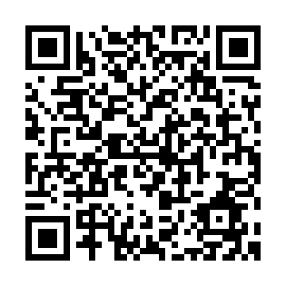

# 勤務時間計算くん

# Introduction
Please add me as a LINE friend via blow QRcode or button. This bot surely help with boring calculation using manpower and a calculator at the end of the month.

&nbsp;&nbsp; 

# Demo
This demo gif shows so slow reply, but actually this bot reply more quickly than this gif shows.

 

# Usage
This bot accept below three formats. You can show a half hour as "xx:30" or "xx.5".This bot will not accept fill-width characters (zenkaku) forms. When you send designated forms, it immediately returns the amount of how long you worked before 22'o clock, and after 22'o clock. If your message contains the information of your hourly wage, it also returns your monthly wages.

## ex.1

The first line indicates the hourly wage. The second line shows the days you did not eat the staff meals. And from the third line, they show your work time. Please hyphenate the time when you started working and the end time.
1. 950
2. 2
3. 17-22.5
4. 18-23:30

## ex.2

If you omit the days you did not eat the staff meals, this bot regards you ate them every time you worked.
1. 950
2. 17-22.5
3. 18-23:30

## ex.3
You can input only work time. In this case, this bot will not calculate and return your wages.
1. 17-22.5
2. 18-23:30
